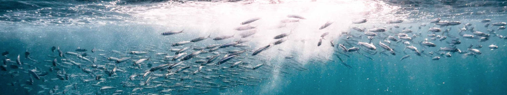

<style type="text/css">

pre code {
  word-wrap: normal;
  white-space: pre;
}
body{ /* Normal  */
   font-size: 12px;
}
td {  /* Table  */
   font-size: 9px;
}
h1 { /* Header 1 */
 font-size: 18px;
 color: DarkBlue;
}
h2 { /* Header 2 */
 font-size: 15px;
 color: DarkBlue;
}
h3 { /* Header 3 */
 font-size: 14px;
 color: DarkBlue;
}
code.r{ /* Code block */
  font-size: 10px;
}
pre { /* Code block */
  font-size: 10px;
  overflow-x: auto;
}
</style>



&nbsp;&nbsp;&nbsp;&nbsp;&nbsp;&nbsp;&nbsp;&nbsp;&nbsp;&nbsp;&nbsp;&nbsp;&nbsp;&nbsp;

 
&nbsp;&nbsp;


```{r, include = FALSE}

library(readxl)
library(kableExtra)
#library(ClimateTest)

knitr::opts_chunk$set(
  collapse = TRUE,
  comment = "#>"
)
knitr::opts_chunk$set(dpi=85, fig.width=7.5, fig.height = 5)


knitr::opts_chunk$set(collapse = TRUE, comment = "#>")

options(width = 650)
X = Y = 0
plus=function(){X=X+1;assign("X",X, envir = globalenv())}
getF = function(rel=1){X+rel}
Tplus = function(){Y=Y+1;assign("Y",Y, envir = globalenv())}
getT = function(rel=1){Y+rel}


plotatab2 <- function(filey,sheet,head=T){
  if(head){
    dat = read_xlsx(filey,sheet)
    kable(dat,"simple") 
  }else{
    dat = read_xlsx(filey,sheet,col_names=F)
    kable(dat,"simple",col.names=rep("",ncol(dat))) 
  }
}


```


<br>
<hr>


# Foreword

This operating model aims to closely mimic a [recent stock assessment for South African Sardine by de Moor 2025](https://science.uct.ac.za/maram/2025-workshop) for the purposes of testing the potential robustness of management options to projected climate changes originating from an Ecoystem Model (Ortega et al. XXX). These analyses are exploratory and didactic and are not intended to inform management decision making at this stage. All data used in the construction of these operating models are publicly available from sources that are cited. 

<br>
<hr>


# Introduction

## Stock Assessment

The assessment includes the revised hypothesis for stock structure and includes a West and a South stock ([Assessment Document BG4, de Moor 2025](https://science.uct.ac.za/sites/default/files/media/documents/science_uct_ac_za/2066/iws-2025-sardine-bg4.pdf)).

This document is intended to guide prospective users on how to:

* work with mahi operating models
* design and test management procedures (MPs)
* summarize MP performance 


##


# Methods

## OpenMSE 2.0

OpenMSE operating models were configured to match historical catches and the estimates of biomass and recruitment arising from the [stock assessment](https://science.uct.ac.za/sites/default/files/media/documents/science_uct_ac_za/2066/iws-2025-sardine-bg4.pdf)

<br>
<hr>


## Parameters

### Natural mortality rate 

From 2022 Assessment [de Moor (2022)](https://doi.org/10.25375/uct.22146602.v1) assuming 1.0 for juvenile and 0.8 for mature fish. 

### Somatic Growth

Combined South + West from 2025 assessment [de Moor 2025](https://science.uct.ac.za/sites/default/files/media/documents/science_uct_ac_za/2066/iws-2025-sardine-bg4.pdf).

### Selectivity 


### Apical F

### Unfished Recruitment

### Annual Recruitment


# Results

## Assessment Comparison

## Example Projections


# Version Notes 

The package is subject to ongoing testing and development. If you find a bug or a problem please send a report to <tom@bluematterscience.com> so that it can be fixed!  

<br>
<hr>


# Background information

Project information, links and results are available from the Climate Test [project webpage](https://blue-matter.github.io/ClimateTest/)

<br>
<hr>

# Software
The [Rapid Conditioning Model](https://openmse.com/tutorial-rcm/) was used to fit operating models to observed data. 


<br>
<hr>


## OpenMSE


The [openMSE R package](https://openmse.com) was used to organize fishery data, define operating models, condition operating models to data, calculate reference points and specify and test existing and alternative management options. 

Visit the [OpenMSE website](https://openmse.com) for more information on the framework including tutorial and case studies.

The Rapid Conditioning Model is also [described there](https://openmse.com/tutorial-rcm)

Other useful openMSE apps include [MERA](https://www.merafish.org/) for rapidly scoping operating models and [Reference Point Calculator](https://shiny.bluematterscience.com/app/rpc) for investigating reference points and control rules. 

## Management Strategy Evaluation

The Ocean Foundation host the [Harvest Strategies website](https://harveststrategies.org/) which is an excellent resource describing MSE, MSE concepts and how MSE can be used in fishery management including introductory videos and interviews with experts. 'Harvest strategy' and Management Procedure are synonymous by the way. 

<br>
<hr>

# References

Hordyk, A., Huynh, Q., Carruthers, T. 2025. OpenMSE: An open-source R package for Management strategy evaluation, available from: https://openmse.com

Huynn, Q., 2025. Rapid Conditioning model. Available from [https://openmse.com/tutorial-rcm/](https://openmse.com/tutorial-rcm/) 

Punt, A.E., Butterworth, D.S., de Moor, C.L., De Oliveira, J.A.A., and Haddon, M. 2016. Management strategy evaluation: Best practices. Fish Fish. 17(2): 303–334. doi:10.1111/faf.12104. 


```{r, echo=FALSE, eval=FALSE}
sfStop()                            
```

<br>
<hr>

